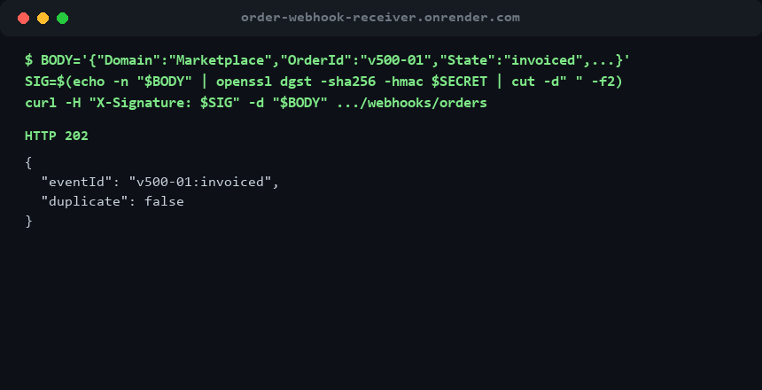

# Order Webhook Receiver

**Live demo:** https://order-webhook-receiver.onrender.com (free tier — sleeps after
15 min idle, first request after that takes ~30-50s to wake up). POST a signed
webhook to `/webhooks/orders` per the example below, then GET
`/api/orders/{orderId}/events` to see it stored.



Receives order status webhooks in the shape VTEX's Orders Hook sends, verifies an
HMAC-SHA256 signature on every request, and stores each status change as an event
you can query per order. Built as a portfolio piece to show the inbound side of an
ecommerce integration: webhook security, idempotency under retries, persistence, tests.

## Stack

- Java 17, Spring Boot 3.3 (Web, Data JPA)
- H2 (file-based) for local runs — no install required
- PostgreSQL for production use (`postgres` profile)

## How it works

1. Sender computes `HMAC-SHA256(secret, rawBody)` and sends it hex-encoded in `X-Signature`.
2. Receiver recomputes it over the **raw** body (before JSON parsing) and compares in
   constant time. Mismatch or missing header → `401`, nothing stored.
3. Event id is `OrderId:State`. Webhook senders retry on timeouts, so a repeated
   event is acknowledged with `200` + `"duplicate": true` instead of being stored twice.
4. New events → `202 Accepted`.

## Run locally

```bash
mvn spring-boot:run
```

App starts on `http://localhost:8080`. Shared secret defaults to `dev-secret`;
override with `WEBHOOK_SECRET`.

## Run against PostgreSQL

```bash
export DB_URL=jdbc:postgresql://localhost:5432/orderwebhook
export DB_USER=postgres
export DB_PASSWORD=postgres
export WEBHOOK_SECRET=change-me
mvn spring-boot:run -Dspring-boot.run.profiles=postgres
```

## Endpoints

| Method | Path                            | Description                                   |
|--------|---------------------------------|-----------------------------------------------|
| POST   | `/webhooks/orders`              | Receive a signed order hook                    |
| GET    | `/api/orders/{orderId}/events`  | Status history for one order, oldest first     |

### Example: simulate a webhook

```bash
BODY='{"Domain":"Marketplace","OrderId":"v500-01","State":"invoiced","LastChange":"2026-09-22T10:00:00Z"}'
SIG=$(printf '%s' "$BODY" | openssl dgst -sha256 -hmac dev-secret | awk '{print $2}')

curl -H "Content-Type: application/json" -H "X-Signature: $SIG" -d "$BODY" localhost:8080/webhooks/orders
# {"duplicate":false,"eventId":"v500-01:invoiced"}   202

curl -H "Content-Type: application/json" -H "X-Signature: $SIG" -d "$BODY" localhost:8080/webhooks/orders
# {"duplicate":true,"eventId":"v500-01:invoiced"}    200

curl -H "Content-Type: application/json" -H "X-Signature: bad" -d "$BODY" localhost:8080/webhooks/orders
# {"error":"invalid signature"}                      401

curl localhost:8080/api/orders/v500-01/events
```

## Tests

```bash
mvn test
```

- `SignatureVerifierTest` — HMAC against a known `openssl` vector, tampered body,
  wrong secret, missing header, case-insensitive hex.
- `WebhookControllerTest` — full HTTP flow with MockMvc on in-memory H2: accept,
  dedupe retry, reject bad signature (nothing stored), reject malformed payload,
  history ordering.

## Run with Docker

```bash
docker compose up --build
```

Builds the image (multi-stage: Maven+JDK to compile, slim JRE to run) and starts
it alongside a real Postgres container, with `WEBHOOK_SECRET=dev-secret`.

## Deploy (Render free tier)

```
┌──────────────┐   push    ┌────────────────┐   JDBC    ┌──────────────────┐
│ GitHub repo   │ ────────▶ │ Render Web      │ ────────▶ │ Render Postgres   │
│ (Dockerfile)  │  builds   │ Service (free)  │           │ (free tier)       │
└──────────────┘   image   └────────────────┘           └──────────────────┘
```

1. Push this repo to GitHub.
2. On [render.com](https://render.com): **New +** → **PostgreSQL** → free plan → name it
   `order-webhook-db` → create. Copy **Host**, **Port**, **Database**, **User**, **Password**
   from its Info tab.
3. **New +** → **Web Service** → connect the GitHub repo → Environment: **Docker** → plan: **Free**.
4. Add environment variables:
   - `SPRING_PROFILES_ACTIVE=postgres`
   - `DB_URL=jdbc:postgresql://<host>:<port>/<database>`
   - `DB_USER=<user>`
   - `DB_PASSWORD=<password>`
   - `WEBHOOK_SECRET=<a real secret, not dev-secret>`
5. Deploy. Free web services sleep after 15 min idle (~30-50s to wake on the next
   request) and free Postgres instances expire after 30 days — recreate the
   database and update the env vars above when that happens, no code changes needed.

## Next steps (portfolio series)

1. Catalog Sync API
2. **Order Webhook Receiver** (this repo)
3. Dockerize + deploy to a cloud free tier
